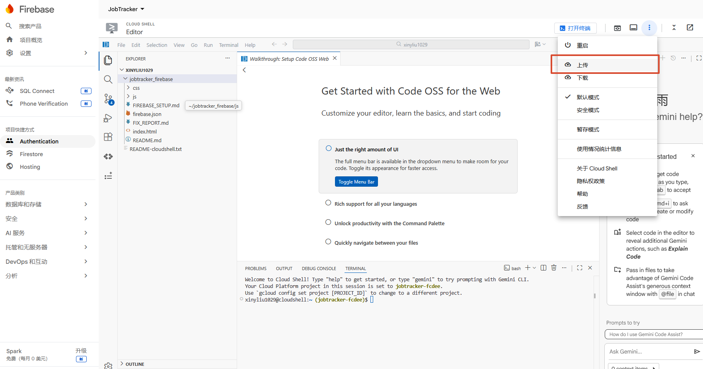

# JobTracker Firebase 同步版使用说明

## 1. 必须先在 Firebase 控制台完成的设置

### 1.1 开启 Google 登录

进入：

Firebase Console → Authentication → Sign-in method → Google → Enable

保存后，项目才能弹出 Google 登录窗口。

### 1.2 设置 Firestore 规则

进入：

Firebase Console → Cloud Firestore → 规则

把规则改成：

```js
rules_version = '2';

service cloud.firestore {
  match /databases/{database}/documents {
    match /users/{userId}/jobtracker/{docId} {
      allow read, write: if request.auth != null && request.auth.uid == userId;
    }
  }
}
```

这条规则表示：只有当前登录用户本人，才能读取和写入自己的 JobTracker 数据。

## 2. 本地运行方式

请不要直接双击 index.html 测试 Google 登录。推荐在项目根目录执行：

```bash
python -m http.server 8000
```

然后访问：

```text
http://localhost:8000
```

## 3. 使用流程

1. 打开网页。
2. 进入“设置”。
3. 点击“Google 登录”。
4. 在有数据的设备上点击“上传到云端”。
5. 在另一台设备上登录同一个 Google 账号。
6. 点击“从云端拉取”。

## 4. 数据保存路径

Firestore 中的数据路径为：

```text
users/{当前用户 uid}/jobtracker/main
```

其中：

- `users`：用户集合。
- `uid`：Firebase 给当前 Google 用户分配的唯一编号。
- `jobtracker`：JobTracker 项目数据集合。
- `main`：保存完整项目数据的文档。

## 5. 常见错误

### auth/unauthorized-domain

当前网址没有加入 Firebase Authentication 授权域名。

解决方式：Firebase Console → Authentication → Settings → Authorized domains，加入当前域名。

本地开发一般使用：

```text
localhost
```

### permission-denied

Firestore 规则拒绝了读写。

解决方式：检查规则是否和上面给出的规则一致，并确认已经登录 Google 账号。

### Firebase SDK 还没有加载完成

浏览器无法加载 Firebase CDN 文件。

解决方式：检查网络是否可以访问 Firebase，或部署到 Firebase Hosting 后再试。

### 6.后续修改代码

在firebase终端中删除以往文件，上传最新文件夹

```text
cd ~
rm -rf ~/jobtracker_firebase
ls
```

点击上传文件夹


```text
cd jobtracker_firebase
firebase deploy --only hosting --project jobtracker-fcdee
```

## 7.如果你想允许几个朋友使用

可以写成这样：

<pre class="overflow-visible! px-0!" data-start="1871" data-end="2324"><div class="relative w-full mt-4 mb-1"><div class=""><div class="relative"><div class="h-full min-h-0 min-w-0"><div class="h-full min-h-0 min-w-0"><div class="border border-token-border-light border-radius-3xl corner-superellipse/1.1 rounded-3xl"><div class="h-full w-full border-radius-3xl bg-token-bg-elevated-secondary corner-superellipse/1.1 overflow-clip rounded-3xl lxnfua_clipPathFallback"><div class="pointer-events-none absolute inset-x-4 top-12 bottom-4"><div class="pointer-events-none sticky z-40 shrink-0 z-1!"><div class="sticky bg-token-border-light"></div></div></div><div class="relative"><div class=""><div class="relative z-0 flex max-w-full"><div id="code-block-viewer" dir="ltr" class="q9tKkq_viewer cm-editor z-10 light:cm-light dark:cm-light flex h-full w-full flex-col items-stretch ͼd ͼr"><div class="cm-scroller"><pre class="cm-content q9tKkq_readonly m-0"><code><span class="ͼm">rules_version</span><span></span><span class="ͼg">=</span><span></span><span class="ͼk">'2'</span><span>;</span><br/><br/><span class="ͼm">service cloud</span><span class="ͼg">.</span><span>firestore {</span><br/><span></span><span class="ͼm">match</span><span></span><span class="ͼg">/</span><span class="ͼm">databases</span><span class="ͼg">/</span><span>{database}</span><span class="ͼg">/</span><span class="ͼm">documents</span><span> {</span><br/><span></span><span class="ͼg">function</span><span></span><span class="ͼm">isAllowedUser</span><span>() {</span><br/><span></span><span class="ͼg">return</span><span></span><span class="ͼm">request</span><span class="ͼg">.</span><span>auth</span><span class="ͼg">.</span><span>token</span><span class="ͼg">.</span><span>email </span><span class="ͼg">in</span><span> [</span><br/><span></span><span class="ͼk">"xinyliu1029@gmail.com"</span><span>,</span><br/><span></span><span class="ͼk">"friend1@gmail.com"</span><span>,</span><br/><span></span><span class="ͼk">"friend2@gmail.com"</span><br/><span>      ];</span><br/><span>    }</span><br/><br/><span></span><span class="ͼm">match</span><span></span><span class="ͼg">/</span><span class="ͼm">users</span><span class="ͼg">/</span><span>{userId}</span><span class="ͼg">/</span><span class="ͼm">jobtracker</span><span class="ͼg">/</span><span>{docId} {</span><br/><span></span><span class="ͼm">allow read</span><span>, </span><span class="ͼm">write</span><span>: </span><span class="ͼg">if</span><span></span><span class="ͼm">request</span><span class="ͼg">.</span><span>auth </span><span class="ͼg">!=</span><span></span><span class="ͼj">null</span><br/><span></span><span class="ͼg">&&</span><span></span><span class="ͼm">request</span><span class="ͼg">.</span><span>auth</span><span class="ͼg">.</span><span>uid </span><span class="ͼg">==</span><span></span><span class="ͼm">userId</span><br/><span></span><span class="ͼg">&&</span><span></span><span class="ͼm">isAllowedUser</span><span>();</span><br/><span>    }</span><br/><span>  }</span><br/><span>}</span></code></pre></div></div></div></div></div></div></div></div></div></div></div></div></pre>
